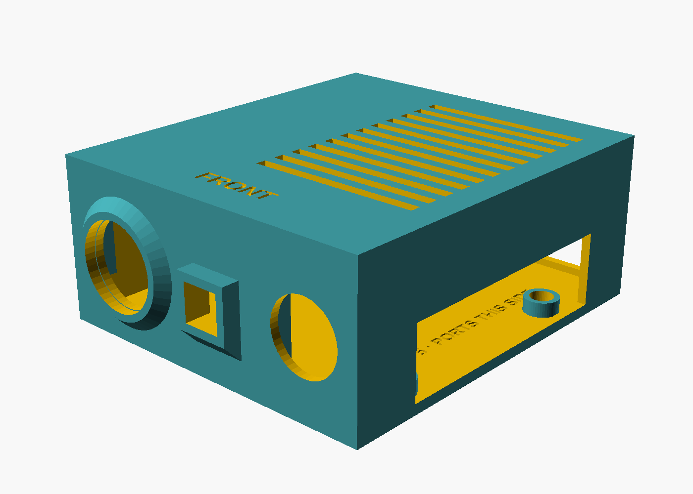

# Enclosure v2

`node_v2.scad` is a new case built from the measured parts (Pi 5 + Active Cooler + PiSugar 3 Plus, Arducam IMX219, HC-SR501, IR light board). The v1 files are untouched.

Two power variants share the same lid, sensor wall and extras. Only the base differs:

| Variant | Base file | Power | Outer size (with lid) |
|---|---|---|---|
| **USB** | `stl/v2_base_usb.stl` | USB-C cable from a power bank, in through the side window | 107 × 96 × 45 mm |
| **PiSugar battery** | `stl/v2_base_pisugar.stl` | PiSugar 5000 mAh pack clipped magnetically under the PiSugar, inside the case. Charge through the same side window. | 107 × 96 × 57 mm |

In the battery variant the stack rests on the battery. A shallow tray locates the pack, and two walls stop the stack sliding toward the sensors or the cable bay. The pack is 67 × 55 × 12 mm as measured, with 3 mm of play on each side.




## What changed from v1

| | v1 | v2 |
|---|---|---|
| Sensors | camera + PIR on the lid, facing up | IR light, camera, PIR in one row on a flat **front** wall that presses against the diorama |
| USB-A / Ethernet | no opening (the port end faced a solid wall) | open **rear** wall |
| USB-C / HDMI / PiSugar ports | window on the wrong edge | window on the **port side**, tall enough for the PiSugar below the Pi |
| PIR vs USB stack | PIR above the USB ports (collision) | PIR beside the Pi, clear of it |
| Camera hole | 9 mm round (the square lens holder's diagonal doesn't fit) | 10.5 mm square, plus an outside hood so IR light doesn't flare into the lens |
| Cooling | one vent row | grille in the lid over the Active Cooler fan, plus side vents |
| Mounting | self-tap standoffs | sockets the PiSugar's studs drop into |
| Extras | none | cable bay beside the Pi, PIR shroud, clear PETG diffuser for the IR light |

## Print

| File | Material | Notes |
|---|---|---|
| `stl/v2_test_plate.stl` | black PLA | **Print this first** (front wall only). Check that the three sensors fit. |
| `stl/v2_base_usb.stl` or `stl/v2_base_pisugar.stl` | black PLA | Pick one. Prints as oriented (open top up). |
| `stl/v2_lid.stl` | black PLA | Already flipped: flat face down. |
| `stl/v2_stand.stl` | black PLA | Tilts the box 20° nose-down so the camera sees the floor. `tilt` in the file. |
| `stl/v2_pir_shroud.stl` | black PLA | Slides over the collar around the PIR dome to narrow its view. |
| `stl/v2_led_diffuser.stl` | clear PETG | Optional cap over the IR lens; softens the hot spot. |

Settings: 0.2 mm layers, 3 walls, 15% infill, no supports needed (the camera hood and PIR collar taper at 45° underneath). Glue stick for PETG. Don't print PLA and PETG fused together; they don't bond.

## Assembly
1. USB variant: drop the Pi + PiSugar stack onto the four sockets. Battery variant: clip the pack onto the PiSugar's magnet, plug its lead into the PiSugar's white socket, and set the whole stack in the tray. Either way, microSD end toward the front and USB-C/HDMI edge toward the port-side window ("PI 5 · PORTS THIS SIDE" is engraved on the floor).
2. Camera: lens holder through the square hole, board slides down between its rails, ribbon connector at the bottom. Hot-glue it.
3. IR light: lens through the round hole on the port side, board slides between the two rails. Hot-glue it. Its power lead runs along the sensor zone into the cable bay and out through the small rear notch.
4. PIR: dome through the big hole, board between its rails, hot-glue. Wires run to the GPIO header.
5. Lid on, with "FRONT" toward the sensor wall.
6. Set the box on the stand, front bottom edge against the lip. The holes in the diorama's back wall need to be a little taller than the sensors because the box is tilted.

## Assumptions to check on the test plate
- ~~IR light board is 21 mm wide (rails 21.8 mm apart).~~ Superseded by the measured fit below. PIR board is 32 mm wide.
- PiSugar ports are on the same long edge as the Pi's USB-C/HDMI (checked against the underside photo: the camera ribbon, which plugs into that edge, exits beside the PiSugar's ports).
- Battery variant: the stack sits loosely on the pouch. Add a strip of double-sided foam tape if it rattles. Don't let anything sharp press on the pouch, and don't use a pack that has puffed up.

Set `power = "usb"` or `"pisugar"` at the top of `node_v2.scad`. All sizes are variables there too. Change a number and run `./build_v2.sh` (needs OpenSCAD 2025+). **`node_v2.scad` is not in this repo**, only the STLs it produced (`original/`); see the next section for how the IR light fit is applied on top of them.

## IR light board fit (2026-09-25)

The vendor drawing for the 850 nm IR light replaces the guessed size. `fit_ir_light.py` patches the v2 STLs (the `.scad` isn't here, only its output) and writes the complete print set to `stl/`. The untouched v2 files stay in `original/`. Previews: `preview/v2_ir_fit_3d.png`, `preview/v2_ir_fit_sections.png`.

| | v2 guess | drawing |
|---|---|---|
| PCB | 21 wide | 19.82 × 27.94 × 1.0 mm, D-shaped (R10 top), solder pads 13.66 apart at the bottom ears |
| Lens | 19 dia (hole 19.8) | 19.0 dia, front face 14.05 in front of the PCB |
| Photoresistor | not modelled | 5.0 dia, tip 8.35 in front of the PCB, lower right of the lens seen from the front |
| Beam | | 100° |

What changed in the sensor wall (both bases, and the test plate):

- **Photoresistor hole**, 6.4 mm, merged with the lens hole into a keyhole. Without it the board could not get closer than 8.35 mm to the wall.
- **The PCB now seats 8.35 mm behind the outside face**, so the photoresistor tip is flush with the outside and the lens stands 5.7 mm proud, the same as the PIR collar and the camera hood. (v2 had the PCB against the wall and the lens 11.6 mm proud.) `PCB_FACE_X` in the script; set it to `2.4` for the old behaviour.
- **Rails** 20.4 mm apart (was 21.8) and 10.6 mm deep (was 5), from the floor to just above the lens axis. Three stops set the PCB depth: a post under the lens barrel (over the notch between the pads), a lip on the right, and a short lip on the left above the photoresistor. Hot-glue the board from behind, as before.
- `v2_led_diffuser.stl` is regenerated 7.2 mm tall for the shorter protrusion.
- `v2_lid.stl`, `v2_stand.stl`, `v2_pir_shroud.stl` are unchanged copies.

Assembly change for step 3: the IR board goes in from **behind**, straight along the lens axis. Lens into the round hole, photoresistor into the small hole, push until the PCB meets the stops. Solder the power wires on the back of the PCB first; they exit toward the cable bay.

Check on the test plate:

- Photoresistor position: 7.0 mm right / 9.3 mm below the lens axis was scaled off the drawing, so its hole is 1.4 mm oversize. If it doesn't line up, change `LDR_DX` / `LDR_DY` and rerun.
- The 8.35 was read as photoresistor tip to the PCB *front* face. If it is to the back face, the tip sits 1 mm inside the wall. Harmless.
- The centre post assumes the notch between the pads is at most ~4 mm deep (post top is 7 mm above the PCB's bottom edge). If the notch is deeper, the post misses and the two side lips set the depth alone.
- The PCB's bottom edge sits 1.06 mm above the floor.

```sh
pip install trimesh manifold3d numpy matplotlib
python3 enclosure/v2/fit_ir_light.py
```
